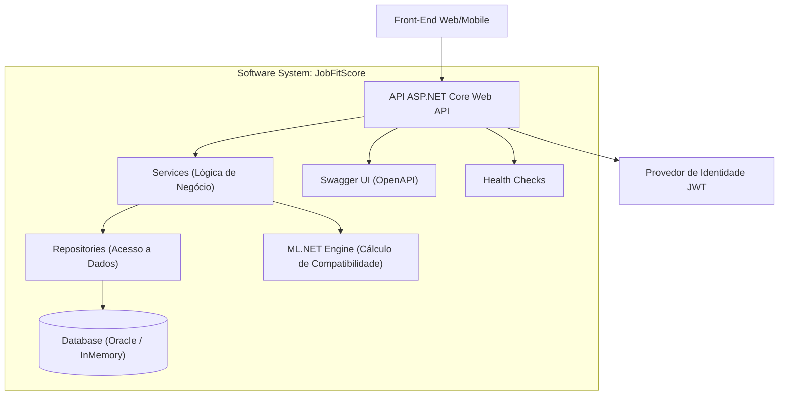
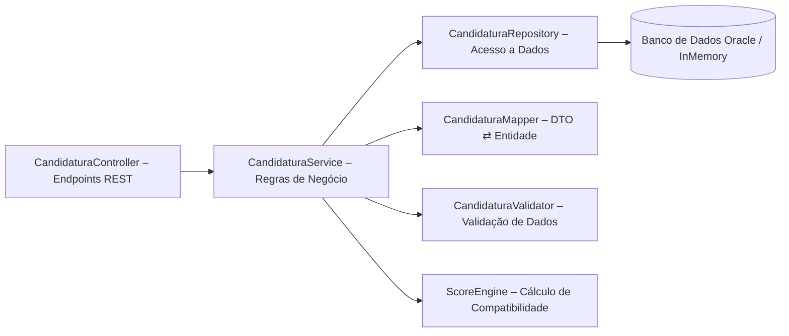

<h1 align="center">
  
  <br><br>
  <b>JobFitScore – Global Solution</b>
</h1>

<p align="center">
  <em>Disciplina:</em> <b>Advanced Business Development with .NET</b><br>
  <em>Professor Orientador:</em> <b>Leonardo Gasparini Romão</b><br>
  <em>Turma:</em> <b>2TDSB</b> — <em>Curso:</em> <b>Tecnologia em Análise e Desenvolvimento de Sistemas – FIAP</b>
</p>

---

### 🧠 Sobre o Projeto

API RESTful desenvolvida em <b>.NET 8</b> para o cálculo de compatibilidade profissional entre candidatos e vagas, 
utilizando análise de habilidades e requisitos com base em técnicas de <b>inteligência computacional</b>.

[](https://www.youtube.com/watch?v=UPBSy_l2NPQ)

---

<p align="center">
  
  
  
  
  
  
  
  
</p>

---

| Branch | Banco de Dados
|--------|-----|
| **🚀 Deploy** | PostgreSQL | 
| **💻 Main** | Oracle SQL | 

---

## Arquitetura do Sistema

O sistema segue arquitetura em camadas (**Controller → Service → Repository → Data → Model**), garantindo modularidade e manutenibilidade.

### 1. Container Diagram



---

### 2. Component Diagram



---

## Funcionalidades Principais

- CRUD completo para Usuários, Vagas, Candidaturas e Cursos  
- Cálculo de **Score de Compatibilidade** entre perfis e vagas  
- Autenticação JWT e proteção de endpoints  
- HATEOAS em todas as respostas  
- Versionamento de API (v1, v2)  
- Health Check (`/api/health/ping`)  
- Swagger/OpenAPI documentado com anotações  
- Estrutura preparada para **Machine Learning com ML.NET**

---

## Cálculo de Compatibilidade

O **JobFitScore** utiliza lógica ponderada (e futura integração com ML.NET) para calcular o **percentual de compatibilidade** entre candidatos e vagas.

### 📊 Exemplo de Avaliação de Match

| Parâmetro | Descrição | Peso (%) |
|-----------|-----------|----------|
| **Habilidades Técnicas** | Comparação direta entre habilidades e requisitos | 40% |
| **Experiência Profissional** | Tempo e área de atuação | 30% |
| **Formação Acadêmica** | Grau de formação compatível com o cargo | 20% |
| **Cursos Recomendados** | Cursos adicionais que elevam o score | 10% |

---

### 🔍 Exemplo de Resultado do Score

```json
{
  "usuario": "Léo Mota Lima",
  "vaga": "Desenvolvedor .NET Pleno",
  "score": 84,
  "recomendacoes": [
    "Aprender fundamentos de Azure DevOps",
    "Completar curso de Entity Framework Core"
  ]
}
```

**Resultado esperado:** Score alto com sugestões de cursos para aprimorar o perfil profissional.

---

### 🎯 Endpoint de Cálculo de Score

**Método:** `POST`  
**URL:** `/api/v1/candidaturas/calcular-score`

**Corpo da requisição:**
```json
{
  "idUsuario": 1,
  "idVaga": 2
}
```

**Resposta de sucesso (200 OK):**
```json
{
  "success": true,
  "message": "Score de compatibilidade calculado com sucesso",
  "data": {
    "usuario": "Fulano da Silva Machado",
    "vaga": "Analista de Sistemas",
    "score": 76,
    "recomendacoes": [
      "Aprender Docker e containers",
      "Fazer curso avançado de C#"
    ]
  },
  "statusCode": 200,
  "timestampUtc": "2025-11-10T14:30:00Z"
}
```

---

## Tecnologias Utilizadas

| Tecnologia | Descrição |
|-------------|------------|
| **.NET 8 / ASP.NET Core** | Framework principal da API |
| **Entity Framework Core** | ORM para Oracle e InMemory |
| **Swagger / Swashbuckle** | Documentação interativa da API |
| **JWT Bearer** | Autenticação e segurança |
| **xUnit** | Testes de unidade e integração |
| **HATEOAS** | Navegação via links semânticos |
| **Oracle / InMemory** | Suporte a múltiplos bancos de dados local |
| **PostgreSQL** | Banco de dados Deploy |

---

## Pré-requisitos

Antes de executar o projeto, certifique-se de ter instalado:

- [.NET 8 SDK](https://dotnet.microsoft.com/download/dotnet/8.0)
- [Oracle Database](https://www.oracle.com/database/technologies/oracle-database-software-downloads.html)
- [Oracle SQL Developer para VSCode](https://marketplace.visualstudio.com/items?itemName=Oracle.sql-developer)
- **Database Client** (Extensão para consultar o banco de dados do Deploy) 
  - [Database Client](https://marketplace.visualstudio.com/items?itemName=cweijan.vscode-database-client2)
  - [Database Client JDBC](https://marketplace.visualstudio.com/items?itemName=cweijan.dbclient-jdbc)

---

## Execução Local

### 1️⃣ Clonar o repositório

```bash
git clone https://github.com/leomotalima/GS-JobFitScore-AdvancedBusiness.git
cd GS-JobFitScore-AdvancedBusiness
```
---

### 2️⃣ Configurar as credenciais do banco de dados

Crie um arquivo .env na raiz do projeto e configure as credenciais do Oracle:

```env
ORACLE_USER_ID=<Seu Username Oracle>
ORACLE_PASSWORD=<Sua Senha Oracle>
ORACLE_DATA_SOURCE=host:porta/nome_do_serviço
ConnectionStrings__OracleConnection=User Id=${ORACLE_USER_ID};Password=${ORACLE_PASSWORD};Data Source=${ORACLE_DATA_SOURCE}
```

> **⚠️ IMPORTANTE:** Altere os valores de `ORACLE_USER_ID`, `ORACLE_PASSWORD` e `ORACLE_DATA_SOURCE` conforme seu ambiente Oracle local.

---

### 3️⃣ Instalar ferramentas e dependências

Execute os seguintes comandos no terminal:

```bash
# Instalar Entity Framework CLI globalmente (se ainda não tiver)
dotnet tool install --global dotnet-ef --version 8.0

# Restaurar pacotes NuGet
dotnet restore

# Compilar o projeto
dotnet build

# Aplicar migrations no banco de dados
dotnet ef database update
```

---

### 4️⃣ Executar a aplicação

Execute a aplicação:

```bash
dotnet run
```

A API estará disponível em: ** [http://localhost:5142/swagger/index.html](http://localhost:5142/swagger/index.html)**

---

## Execução Deploy


## 🌐 URLs de Acesso ao Deploy

- **API Base URL:** https://gs-jobfitscore-advancedbusiness.onrender.com
- **Documentação Swagger:** https://gs-jobfitscore-advancedbusiness.onrender.com/swagger
- **Health Check:** https://gs-jobfitscore-advancedbusiness.onrender.com/api/health
- **Health Ping:** https://gs-jobfitscore-advancedbusiness.onrender.com/api/health/ping

#### Conexão PostgreSQL 

1. Clique no ícone do **Database Client** na barra lateral do VSCode
2. Clique em **"Create Connection"** (ícone de +)
3. Selecione **PostgreSQL**
4. Preencha os dados:
   ```
   Host: dpg-d4fsf8je5dus739eca20-a.oregon-postgres.render.com
   Port: 5432
   Username: rm554874
   Password: IAyXzKtRHCD0lkZi4EqKVQ4gge1pRKCu
   Database: jobfitscore_dviy
   ```
6. Marque a opção **SSL** (obrigatório para Render)
7. Clique em **Connect**

---

## Estrutura do Projeto

```
.
├── AppDbContextFactory.cs
├── appsettings.Development.json
├── appsettings.json
├── Controllers
│   ├── v1
│   │   ├── CandidaturaController.cs
│   │   ├── CursoController.cs
│   │   ├── EmpresaController.cs
│   │   ├── HabilidadeController.cs
│   │   ├── LoginController.cs
│   │   ├── UsuarioController.cs
│   │   ├── UsuarioHabilidadeController.cs
│   │   ├── VagaController.cs
│   │   └── VagaHabilidadeController.cs
│   └── v2
│       ├── CursoController.cs
│       ├── EmpresaController.cs
│       ├── HabilidadeController.cs
│       ├── LoginController.cs
│       ├── MlController.cs
│       ├── StatusController.cs
│       ├── UsuarioController.cs
│       ├── UsuarioHabilidadeController.cs
│       ├── VagaController.cs
│       └── VagaHabilidadeController.cs
├── Data
│   └── AppDbContext.cs
├── Dockerfile
├── Dtos
│   ├── Candidatura
│   │   ├── CandidaturaInput.cs
│   │   └── CandidaturaOutput.cs
│   ├── Curso
│   │   ├── CursoInput.cs
│   │   └── CursoOutput.cs
│   ├── Empresa
│   │   ├── EmpresaInput.cs
│   │   ├── EmpresaOutput.cs
│   │   └── EmpresaUpdateInput.cs
│   ├── Habilidade
│   │   ├── HabilidadeInput.cs
│   │   └── HabilidadeOutput.cs
│   ├── Usuario
│   │   ├── JobFitEntradaDto.cs
│   │   ├── JobFitResultadoDto.cs
│   │   ├── UsuarioInput.cs
│   │   ├── UsuarioOutput.cs
│   │   └── UsuarioUpdateInput.cs
│   ├── UsuarioHabilidade
│   │   ├── UsuarioHabilidadeInput.cs
│   │   └── UsuarioHabilidadeOutput.cs
│   ├── Vaga
│   │   ├── VagaInput.cs
│   │   ├── VagaOutput.cs
│   │   └── VagaUpdateInput.cs
│   └── VagaHabilidade
│       ├── VagaHabilidadeInput.cs
│       └── VagaHabilidadeOutput.cs
├── JobFitScoreAPI.csproj
├── JobFitScore.Tests
│   ├── appsettings.Testing.json
│   ├── CustomWebApplicationFactory.cs
│   ├── Integration
│   │   ├── HealthCheckTests.cs
│   │   ├── LoginIntegrationTests.cs
│   │   ├── TestAuthHandler.cs
│   │   └── UsuarioControllerIntegrationTests.cs
│   ├── JobFitScore.Tests.csproj
│   └── Unit
├── Migrations
│   ├── 20251121012808_InitialCreate.cs
│   ├── 20251121012808_InitialCreate.Designer.cs
│   └── AppDbContextModelSnapshot.cs
├── Models
│   ├── Candidatura.cs
│   ├── Curso.cs
│   ├── Empresa.cs
│   ├── Habilidade.cs
│   ├── HashHelper.cs
│   ├── JobFitData.cs
│   ├── UsuarioConfiguration.cs
│   ├── Usuario.cs
│   ├── UsuarioHabilidade.cs
│   ├── UsuarioLogin.cs
│   ├── Vaga.cs
│   └── VagaHabilidade.cs
├── Program.cs
├── Properties
│   └── launchSettings.json
├── README.md
├── Repositories
│   ├── CandidaturaRepository.cs
│   ├── EmpresaRepository.cs
│   ├── HabilidadeRepository.cs
│   ├── ICandidaturaRepository.cs
│   ├── IEmpresaRepository.cs
│   ├── IHabilidadeRepository.cs
│   ├── IUsuarioRepository.cs
│   ├── IVagaRepository.cs
│   ├── UsuarioRepository.cs
│   └── VagaRepository.cs
├── Scripts
│   ├── ml_jobfitscore.csv
│   └── remover-todas-tabelas.sql
├── Services
│   ├── CandidaturaService.cs
│   ├── CryptoService.cs
│   ├── CursoService.cs
│   ├── EmpresaService.cs
│   ├── HabilidadeService.cs
│   ├── ICryptoService.cs
│   ├── IVagaService.cs
│   ├── JobFitMLService.cs
│   ├── JwtService.cs
│   ├── UsuarioHabilidadeService.cs
│   ├── UsuarioService.cs
│   ├── VagaHabilidadeService.cs
│   └── VagaService.cs
├── Static
│   └── images
│       └── logo.png
└── Swagger
    ├── OrdenarTagsDocumentFilter.cs
    ├── SwaggerAllowAnonymousFilter.cs
    └── SwaggerSecurityRequirementsFilter.cs
```

---

## Health Check
```http
GET /api/health/ping
```
**Resposta:**
```json
{
  "success": true,
  "message": "API rodando com sucesso 🚀",
  "data": {
    "status": "Healthy",
    "version": "1.0.0",
    "uptime": "00:00:00",
    "environment": "Development",
    "host": "<nome do host>",
    "timestampUtc": "2025-11-10T12:50:01.517Z"
  },
  "statusCode": 200,
  "timestampUtc": "2025-11-10T12:50:01.517Z"
}
```
---

## Testes Automatizados


**Executando os testes manualmente:**
```bash
cd JobFitScore/JobFitScore.Tests
dotnet clean
dotnet build
dotnet test
```
> Todos os testes rodam com banco **InMemory**, sem necessidade do Oracle local.

---

## Equipe de Desenvolvimento

<table align="center">
<tr>
<td align="center">
<a href="https://github.com/thejaobiell">
<br>
<sub><b>João Gabriel Boaventura</b></sub><br>
<sub>RM554874 • 2TDSB2025</sub><br>
</a>
</td>
<td align="center">
<a href="https://github.com/leomotalima">
<br>
<sub><b>Léo Mota Lima</b></sub><br>
<sub>RM557851 • 2TDSB2025</sub><br>
</a>
</td>
<td align="center">
<a href="https://github.com/LucasLDC">
<br>
<sub><b>Lucas Leal das Chagas</b></sub><br>
<sub>RM551124 • 2TDSB2025</sub><br>
</a>
</td>
</tr>
</table>
